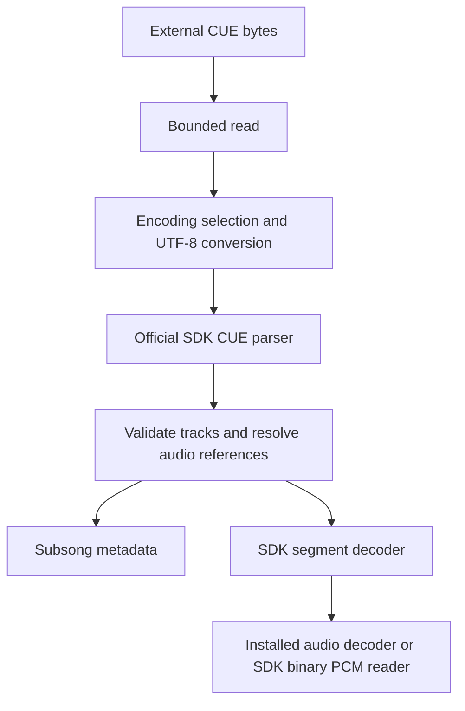

# Architecture and data flow

CUE Charset translates the text layer of an external CUE sheet before the SDK parses it.
Keeping conversion ahead of parsing gives metadata and referenced filenames the same encoding
policy. Audio decoding stays with foobar2000's installed decoders and SDK helpers.

## Two boundaries

The [encoding module](../../src/encoding/decoder.hpp) operates on byte spans and owned strings.
It has no dependency on the player. This makes conversion rules testable without a running
foobar2000 instance and keeps malformed-input handling separate from service registration.

The integration layer adapts those results to SDK types. [cue_sheet.cpp](../../src/cue_sheet.cpp)
wraps the official parser and adds track validation; [cue_input.cpp](../../src/cue_input.cpp)
handles file access, source probing, subsongs, and decoding. The project does not duplicate the
CUE grammar or implement audio codecs.

## Buffer ownership

The raw bytes remain in a local vector until `open()` returns. A known file size is checked
before reading, and a bounded read loop also handles unknown or inaccurate sizes. This second
check prevents the size hint from being the only protection against excessive input.

Conversion produces an owned UTF-8 string. The input instance keeps a copy for later metadata
queries because the SDK's `parse_info` reads the complete CUE again for a selected track.
Each distinct resolved audio source has its own cached technical information. The active
`input_helper_cue` owns the underlying decoder while a track is being decoded.

## Track boundaries and source types

Tracks begin at `INDEX 01`. A track followed by another in the same source receives a positive
segment length. Only the terminal track uses the helper's decode-to-end behavior. Treating
an invalid interval as a terminal track would cause overlapping playback and conversion, so
equal or decreasing timestamps are rejected. Validation also runs after path resolution to
cover different names that resolve to one source.

The parsed FILE type is retained through source probing and playback. `BINARY` selects the SDK
raw PCM reader; other types select normal decoder services. A source cannot change between
binary and decoded interpretations within the same sheet.

## Reference resolution

The resolver first uses the SDK relative-path API and canonicalization. An explicit retry
relative to the CUE directory handles references that did not resolve on the first path.

For non-binary sources, a unique same-basename extension substitute accommodates CUEs that
still name a WAV image after it has been transcoded. Multiple matches are ambiguous. Binary
sources never use this substitution: compressed bytes interpreted as PCM could become noise.
The exact candidate list is in the [behavior reference](../reference/behavior.md#referenced-audio).

## Configuration and errors

SDK `cfg_var_modern` objects persist the detection mode, fallback, and logging preference.
These objects provide thread-safe access; each open reads the current validated options.
The preferences page changes the same configuration objects.

Conversion errors become SDK data errors. Malformed CUE syntax is reported with a bounded
message, while project track-validation errors describe the invalid relationship. Tag-write
opens return the SDK's unsupported result. Missing audio can remain listed so the user can
repair a reference, with failure deferred to opening the decoder.

## Cancellation

The encoding module accepts a callback that throws when cancellation is requested. Validation,
copying, NUL scanning, and conversion poll during processing; legacy Win32 calls use bounded
chunks. Finishing a Unicode scalar before polling avoids splitting a multibyte sequence.

The official CUE parser has no callback parameter. Checks immediately before and after each
parse preserve the SDK integration boundary, but cannot interrupt a parse already in progress.
Its work remains bounded by the document-size limit. Per-track loops, file operations, metadata
requests, and decoder calls also check or receive cancellation. Abort exceptions propagate
unchanged instead of becoming conversion errors.

## Why reads remain read-only

In-memory translation avoids rewriting a user's original CUE merely because it was scanned or
played. It also avoids needing to reproduce formatting or encode edited tags back into a
legacy code page. Conversion for playback and on-disk editing therefore remain separate actions.

For precise limits and APIs, see [Behavior](../reference/behavior.md),
[Encoding API](../reference/encoding-api.md), and [SDK API reference](../reference/sdk-api.md).
For the service choice, read [Why a redirecting input](sdk-integration.md).

[Documentation home](../README.md)
